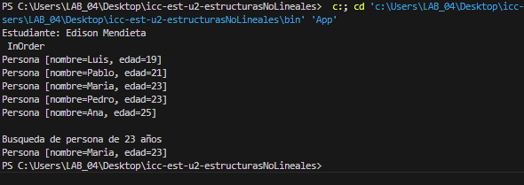

# Práctica: Estructuras No Lineales - 

## Autor
- Nombre: Edison Mendieta
- Carrera/Curso: Estructura de Datos

##  Nombre de la práctica - Fecha
- Práctica: Práctica de Árboles – Implementación Integers
- Fecha: 2026-1-06

## Descripción
Objetivo 1. Implementar un Árbol Binario de Búsqueda para enteros con recorridos PreOrder, InOrder, PostOrder y un método size() que retorne el total de nodos en complejidad O(1).
Objetivo 2. Implementar un Árbol Binario de  de Búsqueda para enteros con recorridos InOrder
#### Entregable. Repositorio con:
Código fuente actualizado.
Evidencias en la carpeta assets/ (o equivalente).
README de la práctica actualizado.

#### Requisitos
El árbol debe permitir inserción de enteros.
Debe imprimir en consola los tres recorridos:
PreOrder
InOrder
PostOrder

Debe imprimir en consola el tamaño del árbol.
size() debe ser O(1). Para cumplirlo, el árbol debe mantener un contador interno (ej. private int size;) que se actualice en insert (y en delete si existiera).

## Evidencias 1
### Captura 1
Evidencia acerca del resultado en Pantalla(Consola)

### Captura 2 
Evidencia acerca del formato de codigo para contador Size(private int size)

## Evidencias 2
### Captura 1
Evidencia acerca de la busqueda del arbol

### Captura 2
codigo de search!
[alt text](assets/code_BusquedaBinaria_Arboles.png)

## Grafos Evidencia

